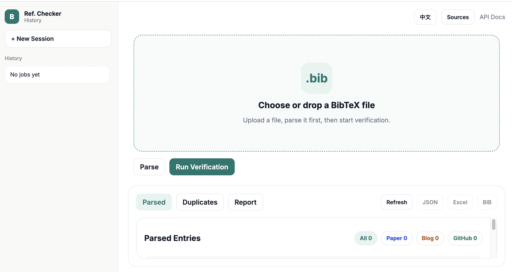

# Ref. Checker

<p align="center">
  
</p>

A no-LLM bibliography verification tool for `.bib` files.

Ref. Checker parses BibTeX entries, classifies references, validates them against configurable sources, detects duplicates, and provides a web UI for review, correction, and export. It is designed for research workflows that need **deterministic**, **rule-based**, and **auditable** reference checking without relying on AI generation.

## Highlights

- Pure rule-based reference verification
- Upload and parse `.bib` files in the browser
- Automatic classification into:
  - `paper`
  - `GitHub`
  - `blog`
- Configurable validation sources:
  - `arxiv`
  - `crossref`
  - `openalex`
  - `serpapi`
  - `scholar-html`
- Duplicate detection by DOI / arXiv ID / normalized title + year
- Review mismatches and apply corrected BibTeX back into a working `.bib`
- Export:
  - Excel report
  - JSON report
  - corrected `.bib`
- Chinese / English UI toggle

## What It Does

Ref. Checker follows a simple pipeline:

1. Parse `.bib` entries into structured metadata
2. Classify each entry as a paper, GitHub repo, or blog/web reference
3. Validate papers against selected scholarly sources
4. Validate GitHub/blog references through URL reachability
5. Compare returned metadata with the original BibTeX entry
6. Mark each result as:
   - `FOUND_MATCH`
   - `FOUND_MISMATCH`
   - `NOT_FOUND`
7. Let users inspect, edit, apply, and export corrections

## Quick Start

### Option A: Docker Compose

Recommended for the fastest deployment.

```bash
cp .env.example .env
docker compose up --build
```

Then open:

```text
http://127.0.0.1:8000
```

### Option B: Conda

```bash
conda env create -f environment.yml
conda activate ref-check
uvicorn backend_api:app --host 0.0.0.0 --port 8000 --reload
```

### Option C: pip

```bash
python3 -m pip install -r requirements.txt
uvicorn backend_api:app --host 0.0.0.0 --port 8000 --reload
```

## Interface Workflow

The web UI is built around a lightweight review workflow:

- Upload a `.bib` file
- Parse entries and inspect duplicate references
- Configure validation sources
- Run verification
- Filter results by:
  - verdict
  - reference type
  - search query
- Open mismatch suggestions in a modal
- Edit the recommended `.bib`
- Apply the correction into the working copy
- Export the final report or corrected bibliography

## Search Sources

The frontend exposes the following sources:

- `arxiv`
- `crossref`
- `openalex`
- `serpapi`
- `scholar-html`

Default UI behavior:

- enabled by default:
  - `arxiv`
  - `crossref`
  - `openalex`
  - `serpapi`
- disabled by default:
  - `scholar-html`

If a user enables only one source, the backend respects that configuration and validates papers only with the selected source(s).

## Reference Types

Ref. Checker currently routes validation based on detected reference category:

### `paper`

Papers are validated against configured scholarly sources and matched by rule-based comparison of:

- title similarity
- author overlap
- year
- venue
- DOI
- arXiv ID

### `GitHub`

GitHub references are validated through URL reachability.

### `blog`

Blog / general web references are also validated through URL reachability.

## Duplicate Detection

Duplicate reference groups are detected using strong, deterministic signals:

- same DOI
- same arXiv ID
- same normalized title + year

## Exports

After verification, the project supports:

- `report.json`
- `report.xlsx`
- corrected `modified.bib`

The Excel report is simplified for manual review and grouped into three sheets:

- `完全匹配`
- `部分匹配`
- `没有找到`

## Environment Variables

Copy `.env.example` to `.env` before deployment.

| Variable | Default | Description |
|---|---:|---|
| `APP_PORT` | `8000` | Host port for Docker Compose |
| `REFCHECK_MAX_UPLOAD_BYTES` | `10485760` | Maximum upload size in bytes |
| `SERPAPI_API_KEY` | empty | Optional SerpApi key |
| `HTTP_PROXY` | empty | Optional outbound proxy |
| `HTTPS_PROXY` | empty | Optional outbound proxy |

The service also supports:

- `REFCHECK_JOB_STORE_DIR`
- `REFCHECK_CACHE_PATH`

These are already configured in `docker-compose.yml`.

## API

Main endpoints:

- `GET /health`
- `GET /api/v1/sources`
- `POST /api/v1/bib/parse`
- `POST /api/v1/jobs`
- `GET /api/v1/jobs`
- `GET /api/v1/jobs/{job_id}`
- `POST /api/v1/jobs/{job_id}/apply-correction`
- `GET /api/v1/jobs/{job_id}/report.json`
- `GET /api/v1/jobs/{job_id}/report.csv`
- `GET /api/v1/jobs/{job_id}/report.xlsx`
- `GET /api/v1/jobs/{job_id}/modified.bib`

## Project Structure

```text
.
├── backend_api.py           # FastAPI entrypoint
├── bib_ref_checker.py       # BibTeX parsing, search adapters, rule-based matching
├── reference_backend.py     # Job store, async analysis, exports, correction workflow
├── frontend/
│   ├── index.html
│   ├── app.js
│   ├── styles.css
│   └── site.css
├── requirements.txt         # Python runtime dependencies
├── environment.yml          # Conda environment
├── Dockerfile               # Container image
├── docker-compose.yml       # One-command deployment
├── Makefile                 # Convenience commands
└── .env.example             # Environment template
```

## Development

If you prefer short commands:

```bash
make install
make dev
make docker-up
make docker-down
```

## Deployment Notes

- `.job_store/` and cache files should not be committed
- Docker Compose persists runtime data in the `refcheck_data` volume
- The repo is intended to stay clean: keep generated reports and local caches out of version control

## Current Scope

Ref. Checker is built for practical BibTeX QA workflows. It focuses on:

- deterministic parsing
- configurable source-based verification
- auditability
- interactive correction

It does **not** use LLMs or AI generation for validation.

## Citation

If you find Ref. Checker useful in your work, please cite:

```bibtex
@misc{zhou2026refchecker,
  author       = {Xueyang Zhou},
  title        = {Ref. Checker: A No-LLM Bibliography Verification Tool for BibTeX Files},
  year         = {2026},
  howpublished = {\url{https://github.com/Zxy-MLlab/Ref-checker}},
  note         = {GitHub repository}
}
```
